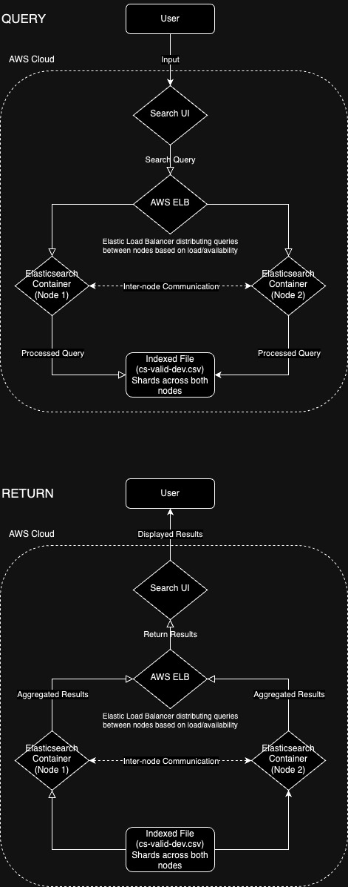

# ASR Dataset Inference and Search Pipeline
## Table of Contents
- Overview
- Pre-requisites
- ASR Inference API
- Dataset Information/Analysis
- Dataset Processing
- Elasticsearch Backend (Dataset Indexing)
- Search UI Frontend
- Cloud Deployment (AWS)
- Future Improvements/Considerations

## Overview
This repository is a step by step process to set up an API for Speech-To-Text inference (and dockerize it), then run an audio dataset through it to obtain the generated transcriptions and durations of the files and update the dataset's manifest. Subsequently, there are scripts provided to index the manifest into an Elasticsearch backend, set up a Search UI frontend to access this information, and also to deploy this service onto cloud.
## Prerequisites
This repository is run and tested on MacBook Air with Apple M2 Chip (ARM64/Aarch64 architecture).<br>
MacOS Sonoma 14.2.1<br>
8GB RAM<br>
Other requirements:<br>
- Docker engine ([Rancher Desktop](https://rancherdesktop.io/) was used)<br>
    ```
    $ docker version
    Client:
    Version:           24.0.2-rd
    API version:       1.42 (downgraded from 1.43)
    Go version:        go1.20.4
    Git commit:        e63f5fa
    Built:             Fri May 26 16:40:56 2023
    OS/Arch:           darwin/arm64
    Context:           rancher-desktop
    ```
- [Miniconda](https://docs.conda.io/projects/miniconda/en/latest/)
- [Homebrew (For MacOS/Linux)](https://brew.sh/)
- Node.js (v18.19.0)
    ```bash
    brew install node@18
    ```
    Run `node -v` to check on your version, it should return `v18.19.0`. If you get a response `node: command not found`, run the command provided when you install node@18:<br>
    ```
    If you need to have node@18 first in your PATH, run:
    echo 'export PATH="/opt/homebrew/opt/node@18/bin:$PATH"' >> ~/.zshrc
    ```
- yarn (Install after Node.js)
    ```
    npm install --global yarn
    ```
## ASR Inference API
### Environment Setup (For running locally)
Navigate to `/asr` and install via Miniconda or PIP. Uncomment the tensorflow packages in `requirements.txt` if using MacOS
```bash
$ conda env create -f environment.yml
$ conda activate asr_api_env
OR
$ conda env create -n asr_api_env python=3.10
$ conda activate asr_api_env
$ pip install -r requirements.txt
```
Install `ffmpeg`
```bash
brew install ffmpeg
```
### Download dataset
Go back to the repository folder and create a folder `data`
```bash
cd ..
# You should be in /htx-asr
mkdir data
```
Download the dataset into this folder `data`. It should have the following folder structure:<br>
The key things to have are `cv-valid-dev` folder and `cv-valid-dev.csv`
```
/data
└── common_voice
    ├── cv-invalid
    │   └── cv-invalid
    ├── cv-other-dev
    │   └── cv-other-dev
    ├── cv-other-test
    │   └── cv-other-test
    ├── cv-other-train
    │   └── cv-other-train
    ├── cv-testing
    ├── cv-valid-dev
    │   └── cv-valid-dev
    ├── cv-valid-test
    │   └── cv-valid-test
    ├── cv-valid-train
    │   └── cv-valid-train
    ├── LICENSE.txt
    ├── README.txt
    ├── cv-valid-dev-backup.csv
    ├── cv-valid-test.csv
    ├── cv-other-dev.csv
    ├── cv-other-train.csv
    ├── cv-valid-dev-test.csv
    ├── cv-valid-dev.csv
    ├── cv-valid-train.csv
    ├── cv-invalid.csv
    └── cv-other-test.csv
```
### Running docker image
Make sure you are in `/htx-asr` folder before running the API. <br>
Otherwise, adjust your paths accordingly. (e.g. if in `asr` folder, then change `./asr` to `.`)<br>
Build and run the Docker image, update version numbers as you see fit:
```bash
docker build --platform=linux/arm64 -t asrapi:1.0.12 ./asr
docker run -p 8001:8001 asrapi:1.0.12
```
### Running locally
Make sure you are in `/htx-asr` folder before running the API. Otherwise, adjust your paths accordingly. (e.g. if in `asr` folder, then change `asr.asr_api:app` to `asr_api:app`)<br>
If you have a larger RAM feel free to adjust `-w 2` to a higher value.
```bash
gunicorn -w 2 -k uvicorn.workers.UvicornWorker asr_api:app --bind 0.0.0.0:8001 --timeout=300
```
### Testing API and running inference
Open another terminal and ping to check if the server is up:
```bash
curl http://localhost:8001/ping
>>> {"response":"pong"}
```
To run inference on a single file, here is an example:
```bash
curl -F file=@data/common_voice/cv-valid-dev/cv-valid-dev/sample-000000.mp3 http://localhost:8001/asr
>>> {"transcription":"BE CAREFUL WITH YOUR PROGNOSTICATIONS SAID THE STRANGER","duration":5.064}
```
### Closing
To close the API, if running locally, press Ctrl+C in the terminal you ran your inference API.<br>
For docker-run API, find the container ID:
```bash
docker ps | grep asr_api
docker stop <CONTAINER_ID>
docker rm <CONTAINER_ID>
```
## Dataset Information/Analysis
The dataset used for testing this code is [Common Voice from Mozilla](https://www.kaggle.com/datasets/mozillaorg/common-voice). We are specifically using `cv-valid-dev`, where `valid` meant that they have been verified by a minimum of listeners that the audio matches the text, `dev` indicating that this set is meant for development and testing. More information can be found in the hyperlink.
## Dataset Processing
To run inference on a dataset:<br>
    Before running, please take note of the following:
    1. Make sure the filepaths `audio_data_path`, `input_csv_path` and `output_csv_path` in `cv-decode.py` are accurate.<br>
    2. If running locally, please comment out line 37 of `asr_api.py`, if not your audio file will be deleted. (`os.remove(temp_wav_path)`)
```bash
python -m asr.cv-decode
```
You should receive an output `cv-valid-dev.csv` in folder `/asr`, which should appear while the process is running as it is updating at regular intervals. There already is one in the repository provided as an example.<br>
**IMPORTANT: Should the process be interrupted halfway, just run it again without removing any files as there are measures implemented to resume from where it left off.**
## Elasticsearch Backend (Dataset Indexing)
### Update environment
Please update your current environment with the following packages, if not already installed:
```bash
pip install elasticsearch==7.15.2
pip install tqdm==4.66.1
```
### Further configuration
Please update Docker vm's `mmap` counts to avoid out-of-memory exceptions. Refer to [this link](https://www.elastic.co/guide/en/elasticsearch/reference/7.15/vm-max-map-count.html) for more information.
```
docker run -it --privileged --pid=host debian nsenter -t 1 -m -u -n -i sh
/ # sysctl -w vm.max_map_count=262144
vm.max_map_count = 262144
```
Input `exit` to exit from the Docker VM terminal.
### Run docker container and index CSV file
Navigate to `/elastic-backend` and run the `docker-compose.yml` file to bring up the cluster and run the indexing service:
```bash
cd elastic-backend/
docker-compose up —build
```
ElasticSearch nodes `es01` and `es02` will start up first, and once at least `es01` is operational, `cv-indexer` service will run, indexing the specified CSV file in the script.<br>
Ensure that the filepath `csv_file` and desired index name `index_name` are correct.<br>
To check whether the nodes are running:
```bash
curl -X GET "localhost:9200/_cat/nodes?v=true&pretty"
```
### Closing
To close the Elasticsearch containers:<br>
In the terminal displaying the container logs, press Ctrl+C<br>
OR with another terminal, navigate to the relevant folder `/elastic-backend`
```bash
cd elastic-backend/
docker-compose down
```
## Search UI Frontend
### Running via Docker
Navigate to `/search-ui`
```
docker-compose up --build
```
You should be able to access the search UI via http://localhost:3000 after the running is complete.<br>
<br>
To close the Search UI frontend:<br>
In the terminal displaying the container logs, press Ctrl+C<br>
OR with another terminal, navigate to the relevant folder `/search-ui`
```bash
docker-compose down
```
### Running locally
Instructions were adapted from [this tutorial on SearchUI](https://docs.elastic.co/search-ui/tutorials/elasticsearch), starting from Step 4<br>
In a separate directory, please download Search UI's starter app:<br>
```bash
curl https://codeload.github.com/elastic/app-search-reference-ui-react/tar.gz/master | tar -xz
```
Navigate to `/app-search-reference-ui-react-main` and replace the following files with the files of the same name provided in `search-ui` folder:
```
App.js (in src folder)
package-lock.json
package.json
engine.json (in src/config folder)
```
This is done to resolve dependency issues and to update the App.js relevant to the content of this repository.<br>

Install the dependencies for Search UI:
```node
yarn
```
Now add the elasticsearch connector library:
```node
yarn add @elastic/search-ui-elasticsearch-connector
```
Start up the page (Make sure that you have not closed the Elasticsearch backend containers from before):
```node
yarn start
```
You should be able to access the search UI via http://localhost:3000 after the running is complete. To end it, press Ctrl+C.
## Cloud Deployment (AWS)
The Search UI can be accessed [here](http://ec2-13-214-153-0.ap-southeast-1.compute.amazonaws.com:3000/), however it is still in the midst of debugging. <br>
Here is a description of the intended deployment architecture, showing the flow during input of query and returning of result:<br>

## Future Improvements/Considerations
### Config files
The file paths and directory paths in the scripts provided, as well as other values such as index name, host addresses are mostly written directly into the code. For more accessible modification and configuration, I would have preferred to use config files to input these values. Another example is using a configurable to determine whether to delete the audio clip after processing it in `/asr`. `True` if running in API to delete the updated temporary file, and `False` if running locally because the local file will be deleted.
### Catering to Multiple Chip Architectures
I wanted to test my code locally as well as via Docker images, hence in the interest of time I had to replicate them as closely as possible. As a result some of the details in the code are specified to cater to the Aarch64 chip architecture, for Macbooks with M1/M2/M3 chips. <br>
If you encounter any issues with regards to Docker image building you may need to adjust some of the code before using it, especially if your setup is using x86-64 (Windows) chip. Some installations are also named differently (aarch64 instead of arm64 and vice versa) so do take note as well.
### Exploratory Data Analysis and Feature Engineering
The Common Voice dataset that was used in this repository, although open-source, was found to have some issues during implementation, such as null values in features like age/accent/gender. A better EDA conducted would have allowed for better handling of the data and fewer issues to debug.<br>
The feature `age` not ideally handled, as its values were in string format, such as "fourties", "teens", "fifties". These are terms that might not typically match if searching for "age", as I would expect integer values to come to mind instead. Given more time I would have liked to assign the values in "age" to an integer range instead (as per the description in the Kaggle data card), then when a number is searched for in the Search UI, this age category would then be suggested.
### Authentication for API connections
Currently the connections to the APIs and containers are not authenticated for ease of testing and debugging, however this poses as a security risk if running in production, as they are currently easily accessible to public. Hence set up of authentication via API keys or restricting access to specific IP addresses would be good.
